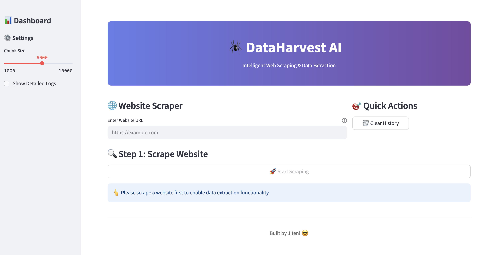

# 🕷️ DataHarvest-AI

DataHarvest-AI is an intelligent web scraper that uses AI to extract specific, structured data from any website using natural language queries. Scrape a site once, then ask multiple questions to get the exact information you need.



<p align="center">
  <a href="#features">Features</a> •
  <a href="#getting-started">Getting Started</a> •
  <a href="#how-it-works">How It Works</a> •
  <a href="#examples">Examples</a> •
  <a href="#contributing">Contributing</a>
</p>

---

## ✨ Key Features

- **🤖 AI-Powered Extraction:** Uses Google's Gemini model to understand natural language queries
- **⚡ Efficient Caching:** Scrape once, ask multiple questions without re-scraping
- **🌐 Dynamic Site Support:** Handles JavaScript-heavy sites and CAPTCHAs via Bright Data
- **📊 Interactive Dashboard:** Clean Streamlit UI with metrics and history tracking
- **📁 Data Export:** Download extracted data in multiple formats
- **🔍 Robust Logging:** Comprehensive logging for debugging and monitoring

---

## 🛠️ Tech Stack

| Category          | Technology              |
| ----------------- | ----------------------- |
| **Backend**       | Python 3.9+             |
| **Web Framework** | Streamlit               |
| **Web Scraping**  | Selenium, BeautifulSoup |
| **Proxy Service** | Bright Data             |
| **AI Model**      | Google Gemini           |
| **Environment**   | python-dotenv           |

---

## 🚀 Getting Started

### 1. Prerequisites

- Python 3.9+
- Access to [Google AI Studio](https://aistudio.google.com/) for a Gemini API Key.
- A [Bright Data](https://brightdata.com/) account for the Scraping Browser Web Driver URL.

### 2. Installation

1.  **Clone the repository:**

    ```bash
    git clone https://github.com/jiten0709/DataHarvest-AI.git
    cd DataHarvest-AI
    ```

2.  **Create and activate a virtual environment:**

    ```bash
    # For macOS/Linux
    uv venv
    source .venv/bin/activate

    # For Windows
    python -m venv .venv
    .venv\Scripts\activate
    ```

3.  **Install the required packages:**

    ```bash
    uv pip install -r requirements.txt
    ```

4.  **Configure environment**

    ```bash
    cp .env.example .env
    # Edit .env with your API keys
    ```

5.  **Run the application**
    ```bash
    cd src
    streamlit run main.py
    ```

## 📝 How It Works

1. **🌐 Input URL:** Enter any website URL you want to scrape
2. **🔄 Smart Scraping:** Selenium handles dynamic content via Bright Data
3. **🧹 Content Processing:** Extract and clean relevant content
4. **💾 Intelligent Caching:** Store content for multiple queries
5. **🤖 AI Extraction:** Query data using natural language
6. **📊 Structured Output:** Get clean, formatted results
7. **Repeat:** Ask more questions about the same content without needing to scrape the site again.

---

## 💡 Examples

### E-commerce Product Extraction

```
URL: https://example-store.com/products
Query: "Extract all product names, prices, and ratings"
```

### Job Listings

```
URL: https://jobs.example.com
Query: "List all job titles, companies, and locations"
```

### Contact Information

```
URL: https://company.example.com/about
Query: "Find all email addresses and phone numbers"
```

---

## 🤝 Contributing

Contributions are welcome! Please feel free to submit a Pull Request.

1. Fork the project
2. Create your feature branch (`git checkout -b feature/AmazingFeature`)
3. Commit your changes (`git commit -m 'Add some AmazingFeature'`)
4. Push to the branch (`git push origin feature/AmazingFeature`)
5. Open a Pull Request

---

<div align="center">

**⭐ Star this repo if you found it helpful!**

Built with ❤️ by [Jiten](https://github.com/jiten0709)

</div>
